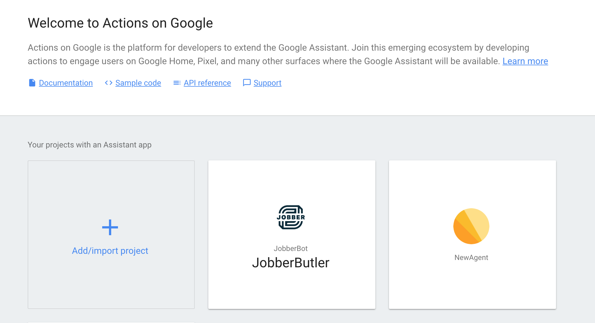
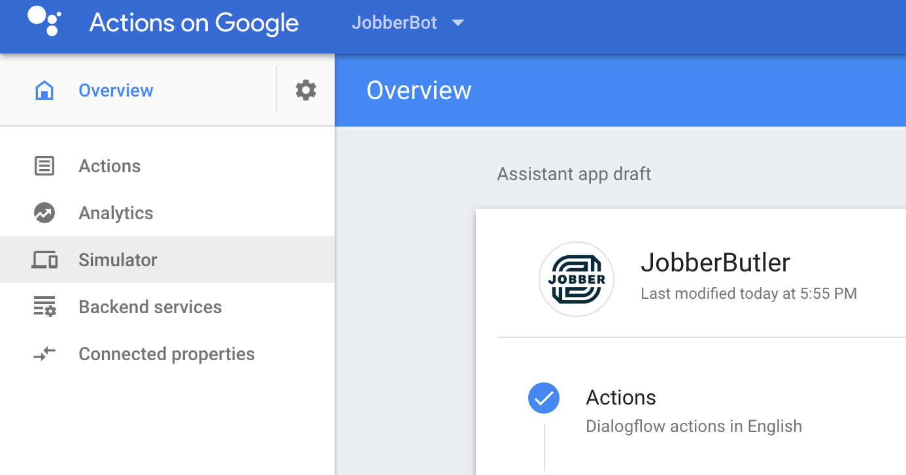
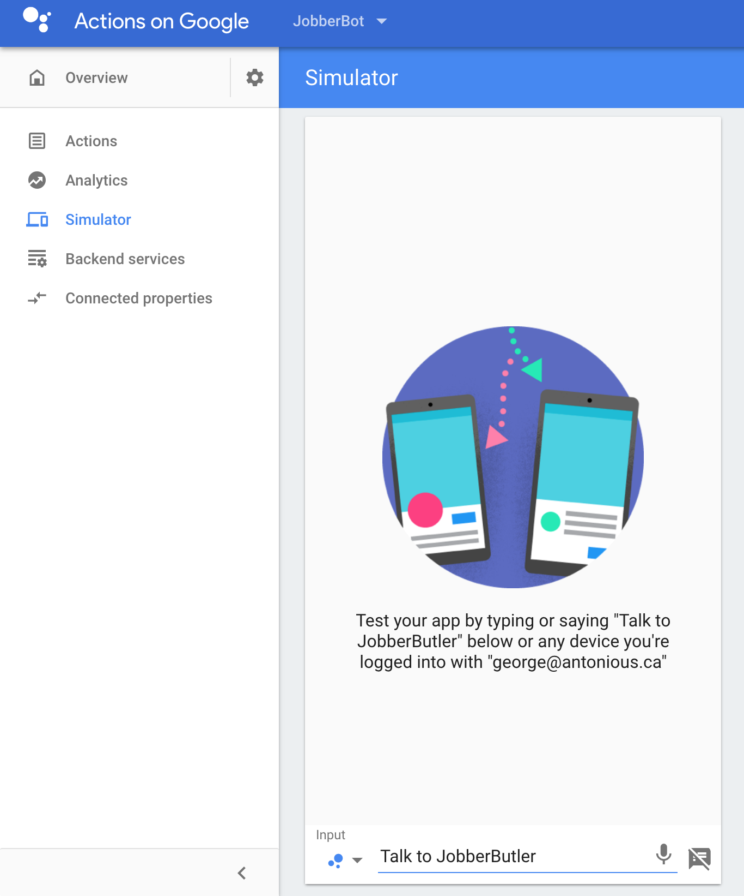
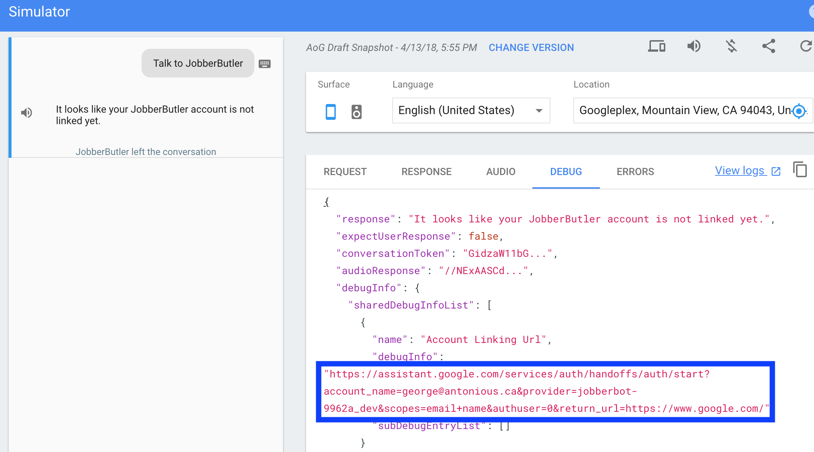
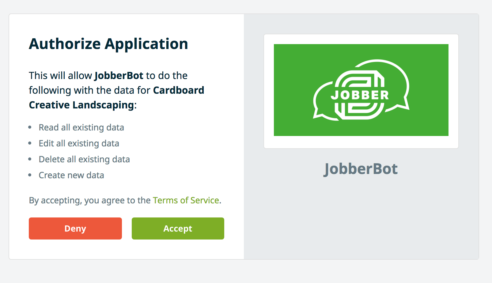
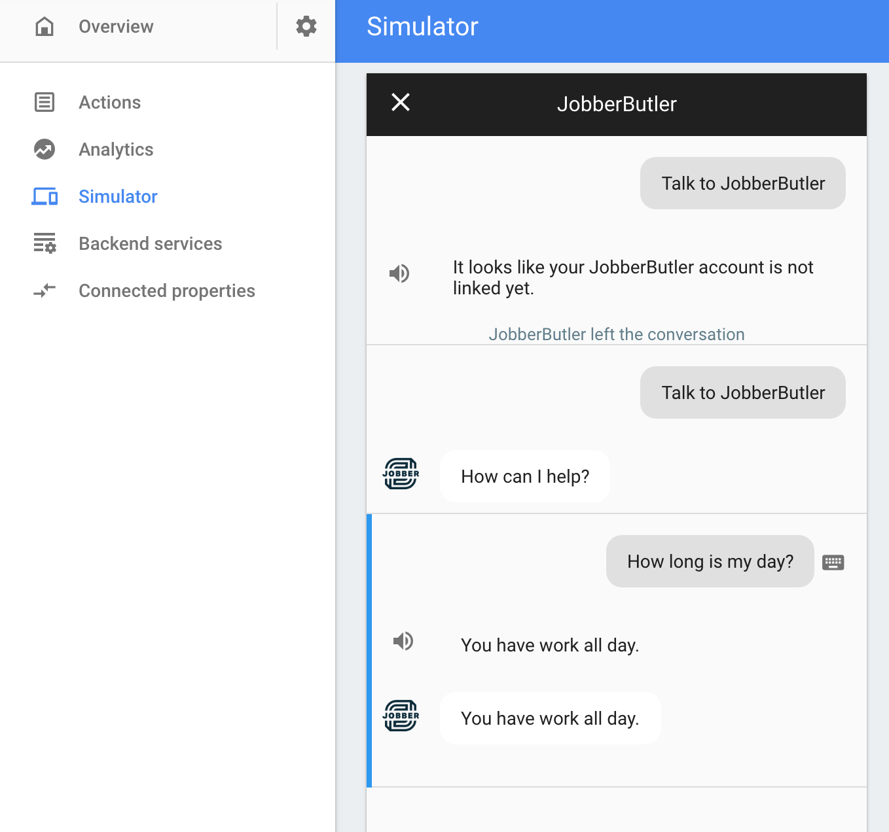

# Using the JobberSmartAssistant

## Step One: Linking Google account to the project

Our application is still in test mode as we haven't received permission from Jobber yet to release our app to the public. So we can only test on our simulator with people on our Google Cloud account. Our Google Assistant project lives in a Google Cloud project if you haven't been added please email antoniou@ualberta.ca to receive access to the project.

## Step Two: Loading the Project

Once you have your account added to our Google Cloud project go to this link: https://console.actions.google.com/

You should see a project named JobberButler as shown below, please select it:

## Step Three: Launching the Simulator

Once you're in the project you need to start up the simulator. The simulator is available on the left hand sidebar.

## Step Four: Launching the JobberSmartAssistant

You can start the JobberSmartAssistant by simply typing "Talk to JobberButler" in the text input dialog at the bottom:

## Step Five: Linking to a Jobber Account

Since this is a test app every so often you will be prompted to link your jobber account to the simulator. (Since this is a test account we can't control how often it happens). If that happens follow the following instructions:

### Navigate to the Authentication URL

Switch to the debug tab on the pane on the right hand and copy the authorization url from the `debugInfo` field:

### Login into Jobber Account

Copy the authorization URL into a new tab and login to the test jobber account with the following credentials:

Email: test@example.com, Password: password

After successfully logging in, give the assistant app authorization to use the test Jobber Account:

## Step Six: Use the Jobber Smart Assistant

Now you should be able to say "Talk to JobberButler" and it will launch the app and let you make requests:

## Bonus: Accessing our Test Jobber Instance

If you want to see the data inside our test instance of Jobber you can log into it here: https://jobber-ondemand-capstone.herokuapp.com/login. Use the same credentials you did for linking the account.